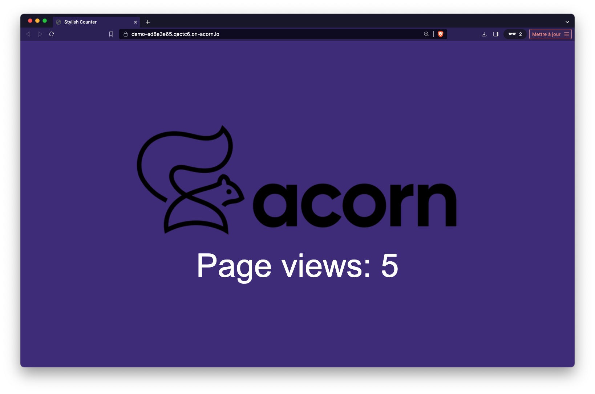

## Redis Database

Redis is an in-memory data store, used as a database, cache, and message broker. It supports various data structures such as strings, hashes, lists, sets, and more, offering high performance and wide-ranging versatility. More information on [https://redis.io](https://redis.io/).

## Redis as an Acorn Service

This Acorn provides a Redis database as an Acorn Service.  It can be used to easily get a Redis database for your application during development. The current service runs a single Redis container backed by a persistent volume and define a password for the default admin user.

## Acorn image

The Acorn image of this service is hosted in GitHub container registry: *ghcr.io/acorn-io/redis*

## Service configuration options

Currently this Acorn does not have any configuration options, but some could be added later on if needed.

## Usage

In the examples folder you can find a sample application using this Service. It consists in a Python backend based on the FastAPI library which returns the number of times the application was called. This incremental value is saved in the underlying Redis database and incremented with each request.

This example can be run with the following command (make sure to run it from the *examples* folder)

```
acorn run -n api
```

After a few tens of seconds you will be returned an http endpoint you can use to acces the application.

Using this endpoint we can access the application and see the counter (which value is persisted in the Redis underlying database) been incremented.




## Deploy the app to your Acorn Sandbox

Instead of managing your own Acorn installation, you can deploy this application in the Acorn Sandbox, the free SaaS offering provided by Acorn. Access to the sandbox requires only a GitHub account, which is used for authentication.

To deploy the Redis example app in your own sandbox, you can:

- use the following link [https://beta.acorn.io/run/ghcr.io/acorn-io/redis/examples:v7.2.1-1](https://beta.acorn.io/run/ghcr.io/acorn-io/redis/examples:v7.2.1-1)

- flash this QR Code


Each method will trigger the launch of the app (you will be required to authenticate using your GitHub account).

## Upgrading your Sandbox

An application running in the Sandbox will automatically shut down after 2 hours, but you can use the Acorn Pro plan to remove the time limit and gain additional functionalities.
